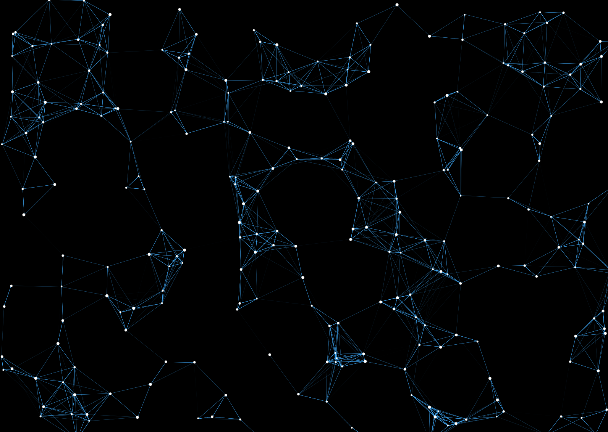

# Moving Network Animation

This project uses JavaScript and HTML5 Canvas to animate a network of nodes and edges. The nodes dynamically interact and form edges based on their proximity, creating a network-like pattern.




## Installation

To install and run the Moving Network Animation on your local machine, follow these simple steps:

```bash
git clone https://github.com/jonassobotta/moving-network-animation.git
cd moving-network-animation
# Open the index.html in your web browser
open index.html # Use `start index.html` on Windows or `xdg-open index.html` on Linux
```

## Configuration

The behavior of the nodes and their network edges can be customized by adjusting the settings in the settings object within the script:

```javascript
const settings = {
    nodeColor: "rgba(255,255,255)",
    edgeColor: "rgba(0,181,255)",
    maxNodes: 250,
    minRadius: 2,
    radiusVariance: 2,
    minSpeed: 0.5,
    speedVariance: 1,
    connectionRadius: 150
};